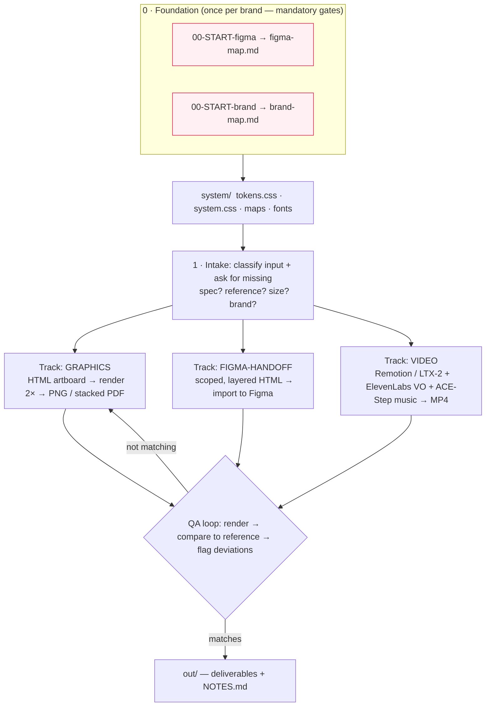

# Process diagram (text / Mermaid source)

The rendered PNG (`process-diagram.png`, built from `process-diagram.html`) is the canonical visual.
This Mermaid version is the editable fallback.

```mermaid
flowchart TD
  subgraph G0["0 · Foundation (once per brand — mandatory gates)"]
    F[00-START-figma → figma-map.md]
    B[00-START-brand → brand-map.md]
  end
  G0 --> SYS[system/  tokens.css · system.css · maps · fonts]
  SYS --> INTAKE[1 · Intake: classify input + ask for missing
  spec? reference? size? brand?]
  INTAKE --> T1[Track: GRAPHICS
  HTML artboard → render 2× → PNG / stacked PDF]
  INTAKE --> T2[Track: FIGMA-HANDOFF
  scoped, layered HTML → import to Figma]
  INTAKE --> T3[Track: VIDEO
  Remotion / LTX-2 + ElevenLabs VO + ACE-Step music → MP4]
  T1 --> QA{QA loop: render → compare to reference → flag deviations}
  T2 --> QA
  T3 --> QA
  QA -- not matching --> T1
  QA -- matches --> OUT[out/ — deliverables + NOTES.md]
  classDef gate fill:#FFF1F3,stroke:#E11D48;
  class F,B gate;
```
